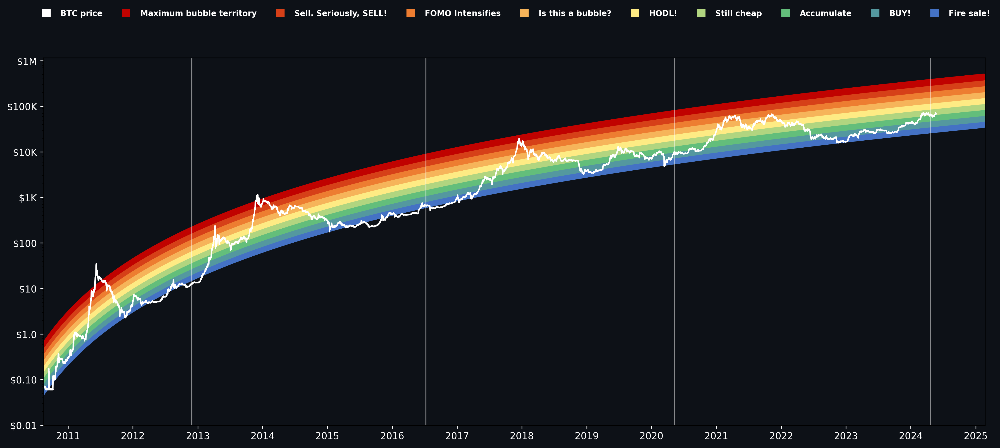

# Bitcoin Rainbow Price Chart 🌈

This is a simple Python script that generates a price chart for Bitcoin using the rainbow chart method. The rainbow chart is a logarithmic chart that shows the price of Bitcoin in different colors based on the logarithmic price scale. This can be used as an indicator to determine when to buy or sell Bitcoin. The chart is generated using the matplotlib library in Python.

<p align="center">
  
  
  <a href="https://github.com/psf/black"></a>
</p>

---

## Introduction

I have seen this indicator many times on the internet and I wanted to create a simple Python script that generates this chart. I used the version found on [coinglass](https://www.coinglass.com/pro/i/bitcoin-rainbow-chart) as a reference. The data is fetched using [Nasdaq's Data Link](https://www.nasdaq.com/nasdaq-data-link) as they had the oldest data available. I used Binance's API to get the most recent data, as Nasdaq's data only goes up to the beginning of 2024.

## Installation ⚙️

The required packages to run this code can be found in the requirements.txt file. To run this file, execute the following code block after cloning the repository:

```bash
pip install -r requirements.txt
```

## Usage ⌨️

To generate the chart, simply run the script using the following command:

```bash
python src/main.py
```

## Example 📊

The following chart is an example of the output generated by the script. The vertical lines represent the halving events of Bitcoin.


### References 📚

The following image was used as a reference for the color scale.


#### Other references

The following websites also provide information about the rainbow chart:

- https://www.lookintobitcoin.com/charts/bitcoin-rainbow-chart/
- https://www.blockchaincenter.net/en/bitcoin-rainbow-chart/

#### TradingView Indicators 📈

The following TradingView indicators do a similar thing:

- https://www.tradingview.com/script/hifY3Gu9-Bitcoin-Rainbow-Logarithmic-Curves/
- https://www.tradingview.com/script/df57YEkg-Bitcoin-Logarithmic-Regression-Rainbow/

## Acknowledgements 🙏

I used the code from [coinmonks' Medium post](https://medium.com/coinmonks/using-python-to-analyze-rainbow-weighted-averaging-a-more-profitable-frequency-investment-12009a8c3617) as an inspiration for this.
